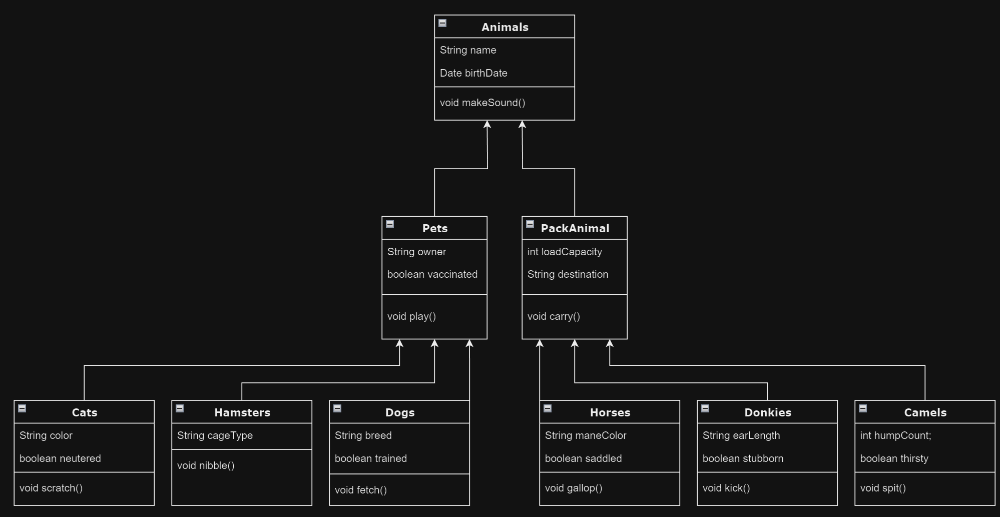

## Легостаев Алексей, группа 4589

***Итоговая контрольная работа:***

**Операционные системы и виртуализация (Linux)**

1. Использование команды cat в Linux:
   - Создать два текстовых файла: "pets"(Домашние животные) и "Pack animals"(вьючные животные), используя команду `cat` в терминале Linux. В первом файле перечислить собак, кошек и хомяков. Во втором — лошадей, верблюдов и ослов.
   - Объединить содержимое этих двух файлов в один и просмотреть его содержимое.
   - Переименовать получившийся файл в "Human Friends"(.
````bash
root@ubuntusrv:~/final_work$ cat > pets
собаки
кошки
хомяки
root@ubuntusrv:~/final_work$ cat > 'pack_animals'
лошади
верблюды
ослы
root@ubuntusrv:~/final_work$ cat pets pack_animals > animals
root@ubuntusrv:~/final_work$ cat animals
собаки
кошки
хомяки
лошади
верблюды
ослы
root@ubuntusrv:~/final_work$ mv animals 'Human Friends'
````
2. Работа с директориями в Linux
   - Создать новую директорию и переместить туда файл "Human Friends".
````bash
root@ubuntusrv:~/final_work$ mkdir animals
root@ubuntusrv:~/final_work$ mv 'Human Friends' animals
root@ubuntusrv:~/final_work$ cd animals/
root@ubuntusrv:~/final_work$ ll
итого 12
drwxrwxr-x 2 root root 4096 фев 14 18:30 ./
drwxrwxr-x 4 root root 4096 фев 14 18:30 ../
-rw-rw-r-- 1 root root   76 фев 14 18:29 Human Friends
````
3. Работа с MySQL в Linux. “Установить MySQL на вашу вычислительную машину ”
   - Подключить дополнительный репозиторий MySQL и установить один из пакетов из этого репозитория.
````bash
root@ubuntusrv:~/final_work/animals$ wget https://dev.mysql.com/get/mysql-apt-config_0.8.26-1_all.deb
root@ubuntusrv:~/final_work/animals$ sudo dpkg -i mysql-apt-config_0.8.26-1_all.deb
root@ubuntusrv:~/final_work/animals$ sudo apt install mysql-client mysql-community-server mysql-server
root@ubuntusrv:~/final_work/animals$ sudo apt update
root@ubuntusrv:~/final_work/animals$ sudo mysql_secure_installation
root@ubuntusrv:~/final_work/animals$ sudo mysql
````
4. Управление deb-пакетами
   - Установить и затем удалить deb-пакет, используя команду `dpkg`.
````bash
root@ubuntusrv:~$ apt download lftp
root@ubuntusrv:~$ sudo dpkg -i lftp_4.9.2-1build1_amd64.deb
root@ubuntusrv:~$ sudo dpkg -r lftp
````
5. История команд в терминале Ubuntu
   - Сохранить и выложить историю ваших терминальных команд в Ubuntu.
````bash
  397  cat > pets
  398  cat > pack_animals
  399  cat pets pack_animals > animals
  400  cat animals 
  401  mv animals 'Human Friends'
  402  ll
  403  mkdir animals
  404  mv 'Human Friends' animals
  405  ll
  406  cd animals/
  407  ll
  408  sudo apt install mysql-server
  409  wget https://dev.mysql.com/get/mysql-apt-config_0.8.26-1_all.deb
  410  sudo dpkg -i mysql-apt-config_0.8.26-1_all.deb
  411  sudo apt update
  412  sudo apt install mysql-client mysql-community-server mysql-server
  413  sudo mysql_secure_installation
  414  sudo mysql
  415  history
  416  apt download lftp
  417  sudo dpkg -i lftp_4.9.2-1build1_amd64.deb
  418  sudo dpkg -r lftp
  419  history 
````

**Объектно-ориентированное программирование** 

6. Диаграмма классов
   - Создать диаграмму классов с родительским классом "Животные", и двумя подклассами: "pets" и "Pack animals".
В составы классов которых в случае pets войдут классы: собаки, кошки, хомяки, а в класс Pack animals войдут: Лошади, верблюды и ослы).
Каждый тип животных будет характеризоваться (например, имена, даты рождения, выполняемые команды и т.д)
Диаграмму можно нарисовать в любом редакторе, такими как Lucidchart, Draw.io, Microsoft Visio и других.


7. Работа с MySQL (Задача выполняется в случае успешного выполнения задачи “Работа с MySQL в Linux. “Установить MySQL на вашу машину”

   7.1. После создания диаграммы классов в 6 пункте, в 7 пункте база данных "Human Friends" должна быть структурирована в соответствии с этой диаграммой. Например, можно создать таблицы, которые будут соответствовать классам "pets" и "Pack animals", и в этих таблицах будут поля, которые характеризуют каждый тип животных (например, имена, даты рождения, выполняемые команды и т.д.).
   
   7.2.
   - В ранее подключенном MySQL создать базу данных с названием "Human Friends".
````SQL
DROP DATABASE IF EXISTS human_friends;
CREATE DATABASE human_friends;
````
   - Создать таблицы, соответствующие иерархии из вашей диаграммы классов.
````SQL
USE human_friends;

CREATE TABLE animals (
	id INT AUTO_INCREMENT PRIMARY KEY, 
	class_name VARCHAR(20)
);

INSERT INTO
	animals (class_name)
VALUES
	('pack_animals'), ('pets');

CREATE TABLE pack_animals (
	id INT AUTO_INCREMENT PRIMARY KEY,
    subclass_name VARCHAR (20),
    class_id INT,
    FOREIGN KEY (class_id) REFERENCES animals (id) ON DELETE CASCADE ON UPDATE CASCADE
);

INSERT INTO 
	pack_animals (subclass_name, class_id)
VALUES
	('horses', 1),
	('donkeys', 1),  
	('camels', 1);
    
CREATE TABLE pets (
	id INT AUTO_INCREMENT PRIMARY KEY,
    subclass_name VARCHAR (20),
    class_id INT,
    FOREIGN KEY (class_id) REFERENCES animals (id) ON DELETE CASCADE ON UPDATE CASCADE
);

INSERT INTO 
	pets (subclass_name, class_id)
VALUES 
	('cats', 2),
	('dogs', 2),  
	('hamsters', 2); 

CREATE TABLE cats (       
    id INT AUTO_INCREMENT PRIMARY KEY, 
    name VARCHAR(20), 
    type_id INT, 
    birthday DATE,
    commands VARCHAR(50),
    Foreign KEY (type_id) REFERENCES pets (id) ON DELETE CASCADE ON UPDATE CASCADE
);

CREATE TABLE dogs (       
    id INT AUTO_INCREMENT PRIMARY KEY, 
    name VARCHAR(20), 
    type_id INT, 
    birthday DATE,
    commands VARCHAR(50),
    Foreign KEY (type_id) REFERENCES pets (id) ON DELETE CASCADE ON UPDATE CASCADE
);

CREATE TABLE hamsters (       
    id INT AUTO_INCREMENT PRIMARY KEY, 
    name VARCHAR(20), 
    type_id INT, 
    birthday DATE,
    commands VARCHAR(50),
    Foreign KEY (type_id) REFERENCES pets (id) ON DELETE CASCADE ON UPDATE CASCADE
);

CREATE TABLE horses (       
    id INT AUTO_INCREMENT PRIMARY KEY, 
    name VARCHAR(20), 
    type_id INT, 
    birthday DATE,
    commands VARCHAR(50),
    Foreign KEY (type_id) REFERENCES pack_animals (id) ON DELETE CASCADE ON UPDATE CASCADE
);

CREATE TABLE donkeys (       
    id INT AUTO_INCREMENT PRIMARY KEY, 
    name VARCHAR(20), 
    type_id INT, 
    birthday DATE,
    commands VARCHAR(50),
    Foreign KEY (type_id) REFERENCES pack_animals (id) ON DELETE CASCADE ON UPDATE CASCADE
);

CREATE TABLE camels (       
    id INT AUTO_INCREMENT PRIMARY KEY, 
    name VARCHAR(20), 
    type_id INT, 
    birthday DATE,
    commands VARCHAR(50),
    Foreign KEY (type_id) REFERENCES pack_animals (id) ON DELETE CASCADE ON UPDATE CASCADE
);
````
   - Заполнить таблицы данными о животных, их командах и датами рождения.
````SQL
INSERT INTO 
	cats (name, type_id, birthday, commands)
VALUES 
	('Rizhik', 1, '2019-05-15', 'makeSound, play, scratch'),
	('Bandit', 1, '2020-02-20', 'makeSound, play, scratch'),  
	('Belyash', 1, '2020-06-30', 'makeSound, play, scratch, catchMouse'); 

INSERT INTO 
	dogs (name, type_id, birthday, commands)
VALUES 
	('Tuzik', 2, '2020-01-01', 'makeSound, play, fetch'),
	('Barbos', 2, '2018-12-10', 'makeSound, play, fetch, paw'),  
	('Sharik', 2, '2019-11-11', 'makeSound, play, fetch, sit'); 

INSERT INTO 
	hamsters (name, type_id, birthday, commands)
VALUES 
	('Pirat', 3, '2021-03-10', 'makeSound, play, nibble'),
	('Grizun', 3, '2021-08-01', 'makeSound, play, nibble'); 

INSERT INTO 
	horses (name, type_id, birthday, commands)
VALUES 
	('Grom', 1, '2015-07-21', 'makeSound, carry, gallop'),
	('Zorka', 1, '2014-05-05', 'makeSound, carry, gallop'),  
	('Miska', 1, '2016-02-29', 'makeSound, carry, gallop');

INSERT INTO 
	donkeys (name, type_id, birthday, commands)
VALUES 
	('Ia', 2, '2017-09-18', 'makeSound, carry, kick'), 
	('Silvestr', 2, '2019-01-23', 'makeSound, carry, kick');  

INSERT INTO 
	camels (name, type_id, birthday, commands)
VALUES 
	('Agata', 3, '2016-11-03', 'makeSound, carry, spit'),
	('Ida', 3, '2018-12-12', 'makeSound, carry, spit'), 
	('China', 3, '2015-08-14', 'makeSound, carry, spit');
````
   - Удалить записи о верблюдах и объединить таблицы лошадей и ослов.
````SQL
DELETE FROM camels;

CREATE TABLE horses_and_donkeys 
SELECT * FROM horses
	UNION 
SELECT * FROM donkeys;
````
   - Создать новую таблицу для животных в возрасте от 1 до 3 лет и вычислить их возраст с точностью до месяца.
````SQL
CREATE VIEW all_animals AS
SELECT 'dog' as animal_type, name, birthday FROM dogs
   UNION ALL
SELECT 'cat' as animal_type, name, birthday FROM cats
   UNION ALL
SELECT 'hamster' as animal_type, name, birthday FROM hamsters
   UNION ALL
SELECT 'horse' as animal_type, name, birthday   FROM horses
   UNION ALL
SELECT 'donkey' as animal_type, name, birthday FROM donkeys;

DROP TABLE IF EXISTS young_animals;
CREATE TABLE young_animals AS
SELECT animal_type, name, 
TIMESTAMPDIFF(MONTH, birthday, CURDATE()) div 12 as age_years,
MOD(TIMESTAMPDIFF(MONTH, birthday, CURDATE()), 12) as age_months
FROM all_animals
WHERE TIMESTAMPDIFF(YEAR, birthday, CURDATE()) BETWEEN 1 AND 3;
````
   - Объединить все созданные таблицы в одну, сохраняя информацию о принадлежности к исходным таблицам.
````SQL
DROP TABLE IF EXISTS all_animals;
CREATE TABLE all_animals

SELECT 
	dg.name,
	p.subclass_name, 
	dg.birthday, 
	dg.commands,
	a.class_name
FROM dogs dg
LEFT JOIN pets p ON p.id = dg.type_id
LEFT JOIN animals a ON a.id = p.class_id
UNION
SELECT 
	ct.name,
	p.subclass_name, 
	ct.birthday, 
	ct.commands,
	a.class_name
FROM cats ct
LEFT JOIN pets p ON p.id = ct.type_id
LEFT JOIN animals a ON a.id = p.class_id
UNION
SELECT 
	hm.name,
	p.subclass_name, 
	hm.birthday, 
	hm.commands,
	a.class_name
FROM hamsters hm
LEFT JOIN pets p ON p.id = hm.type_id
LEFT JOIN animals a ON a.id = p.class_id
UNION
SELECT 
	hr.name,
	pa.subclass_name, 
	hr.birthday, 
	hr.commands,
	a.class_name
FROM horses hr
LEFT JOIN pack_animals pa ON pa.id = hr.type_id
LEFT JOIN animals a ON a.id = pa.class_id
UNION
SELECT 
	dk.name,
	pa.subclass_name, 
	dk.birthday, 
	dk.commands,
	a.class_name
FROM donkeys dk
LEFT JOIN pack_animals pa ON pa.id = dk.type_id
LEFT JOIN animals a ON a.id = pa.class_id
UNION
SELECT 
	cm.name,
	pa.subclass_name, 
	cm.birthday, 
	cm.commands,
	a.class_name
FROM camels cm
LEFT JOIN pack_animals pa ON pa.id = cm.type_id
LEFT JOIN animals a ON a.id = pa.class_id
````
8. 